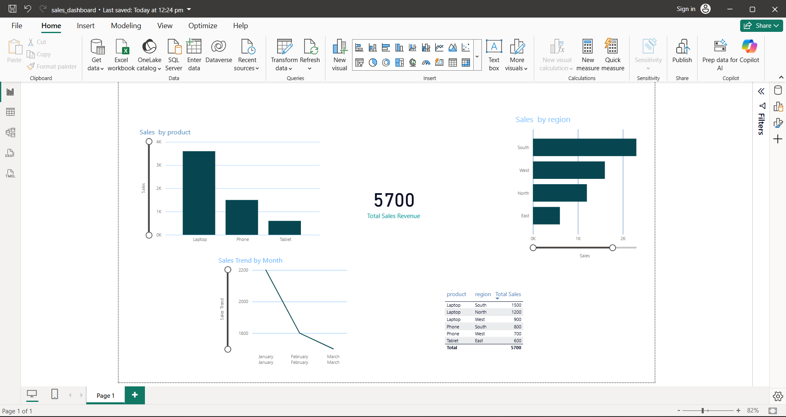

# Power BI Sales Dashboard

## Project Overview
This project presents a sales analytics dashboard built using Power BI. The dashboard provides insights into product performance, regional sales distribution, and monthly sales trends.

The goal of this project is to demonstrate data visualization and business intelligence skills using Power BI.

---

## Tools Used
- Power BI
- Microsoft Excel
- Data Visualization
- Data Analysis

---

## Dataset
The dataset contains sales transaction data including:

- Product
- Region
- Sales Amount
- Order Date

The data is used to analyze sales distribution, product performance, and revenue trends.

---

## Dashboard Features

### Total Sales Revenue
Displays the total revenue generated from all sales.

### Sales by Product
Shows which products generated the highest revenue.

### Sales by Region
Highlights regional sales performance.

### Monthly Sales Trend
Displays how sales change over time.

### Sales Table
Shows detailed transaction data for deeper analysis.

---

## Key Insights

- The **South region generated the highest sales revenue**.
- **Laptop is the top-performing product**.
- Sales show a **declining trend across the first three months**.
- Regional performance varies significantly.

---

## Dashboard Preview

---

## Project Purpose
This project demonstrates practical skills in:

- Data visualization
- Business intelligence
- Dashboard design
- Sales data analysis

---

## Author
Harsha Vardhan
